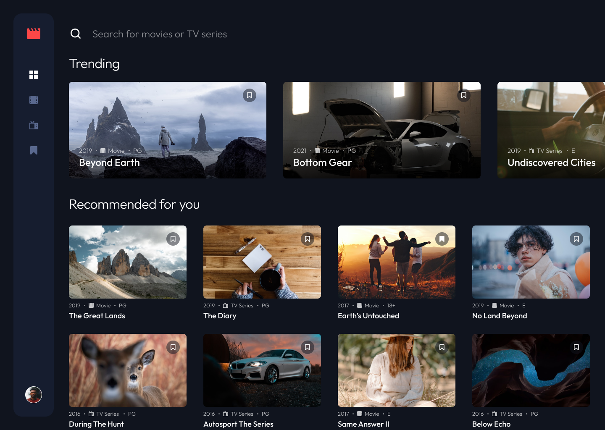
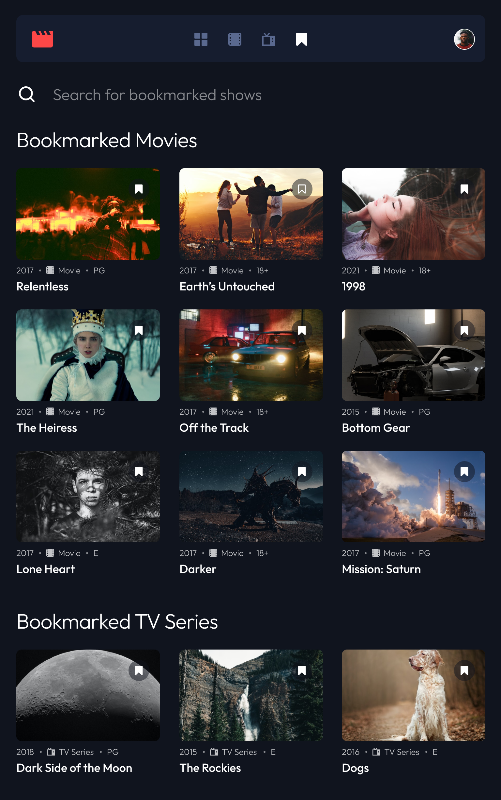
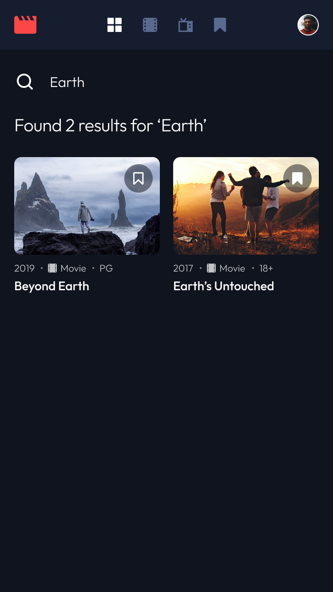

## [Live here](https://entertainment-web-nine.vercel.app/)

## [Desing from](https://www.frontendmentor.io/home)

# Screenshots









# The challenge

Users should be able to:

- View the optimal layout for the app depending on their device's screen size
- See hover states for all interactive elements on the page
- Navigate between Home, Movies, TV Series, and Bookmarked Shows pages
- Add/Remove bookmarks from all movies and TV series
- Search for relevant shows on all pages

# Built with

- [React](https://reactjs.org/) - JS library
- [Next.js](https://nextjs.org/) - React framework
- [Tailwind](https://tailwindcss.com/) - Library for styles

## Getting Started

First install packages

```bash
npm run i
```
then run the development server:
```bash
npm run dev
# or
yarn dev
# or
pnpm dev
```
Open [http://localhost:3000](http://localhost:3000) with your browser to see the result.
